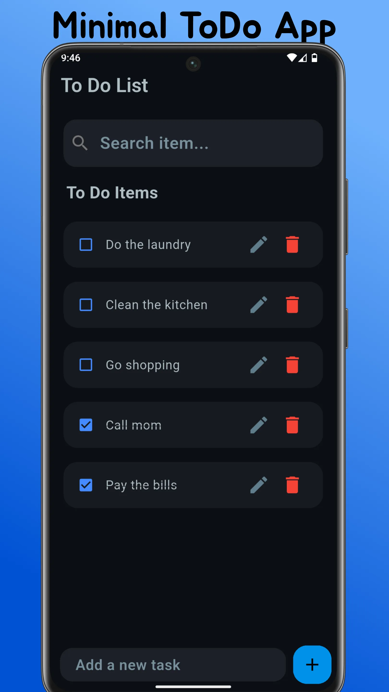
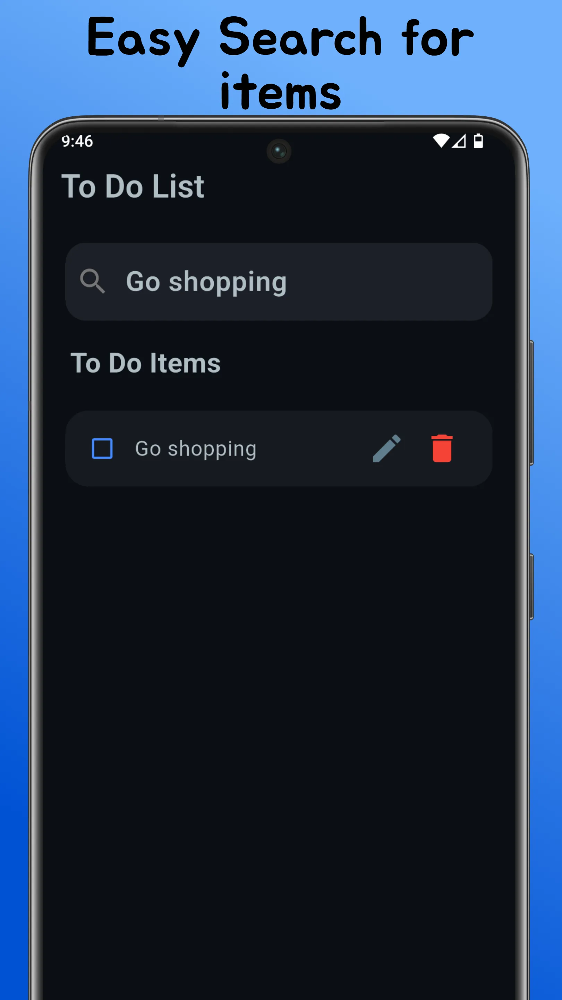
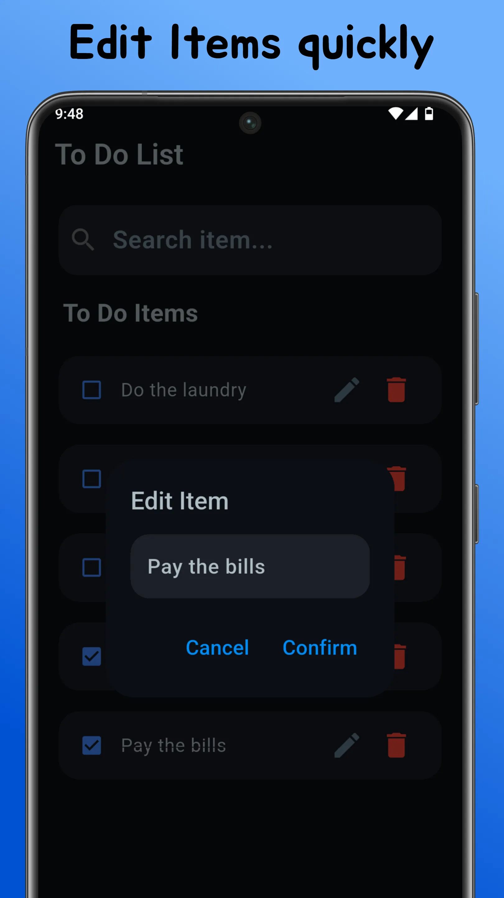

# Flutter ToDo App

A Simple to use, privacy focused ToDo App.

   
   
   

## Features

- **Add ToDo Item**: Create a new task and add it to your list.
- **Check/Uncheck ToDo Item**: Mark a task as completed or not completed.
- **Edit ToDo Item**: Update the title of an existing task.
- **Delete ToDo Item**: Remove a task from your list permanently.
- **Search ToDo item**: Find tasks by typing keywords or phrases.

## Installation

To download and install the app, visit the [official download page](https://euhfs.onrender.com/pages/download-page/todo_app.html).  
You can also find available releases in the [Releases](https://github.com/euhfs/todo_app/releases) section of this repository.

## Future Plans

- Add About Page
- Add Import/Export

## License

This project is licensed under the **Apache 2.0 License**.  
For more information, refer to the [LICENSE](LICENSE) file included in the repository.